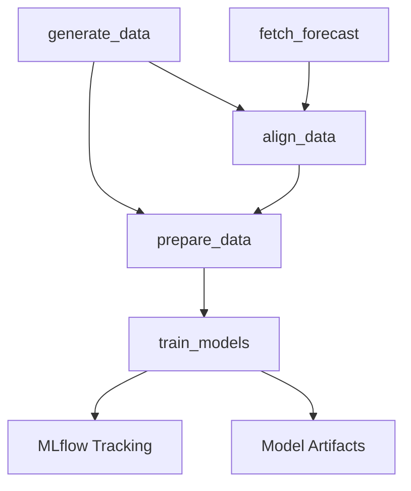

# Wind Speed Prediction using Machine Learning

## MLOps Pipeline for Local Wind Forecast Correction

---

## Project Overview

This project demonstrates a complete machine learning pipeline for **local wind speed prediction** by correcting coarse weather forecasts with local measurements.
Built as a professional portfolio showcase, it implements end-to-end ML workflows with modern tools and best practices.

## Prerequisites

- Python 3.10–3.12 (project requires Python >=3.10,<3.13)
- uv package manager (`https://github.com/astral-sh/uv`)
- DVC (`https://dvc.org/doc/install`)
- MLflow (`https://mlflow.org/docs/latest/index.html`)

## Key Features

* Multi-model Training: Linear Regression, Ridge Regression, Random Forest
* MLflow Tracking: Experiment logging and model versioning
* DVC Pipelines: Reproducible data workflows
* Feature Engineering: Temporal patterns, rolling statistics
* Automated Testing: Unit & E2E tests

---

## Project Structure

```
wind-ml-project/
src/wind_ml_project/
  ├️ data_generator.py
  ├️ data_preprocessing.py
  ├️ model_training.py
  └️ pipeline.py
configs/params.yaml
data/
models/
results/
tests/
dvc.yaml
README.md
```

---

## Quickstart

1. **Setup environment:**

```bash
uv sync
```

2. **Run the complete pipeline:**

```bash
dvc repro
# or (direct run)
uv run python src/wind_ml_project/pipeline.py
```

3. **Launch MLflow tracking UI:**

```bash
mlflow ui
# Open http://localhost:5000
```

4. **Run tests:**

```bash
uv run pytest
```

5. **Fetch forecast (Open-Meteo):**

```bash
PYTHONPATH=src uv run python -m wind_ml_project.data_sources.weather_providers.open_meteo \
  --lat 49.223 --lon 18.739 --hours 48 --out data/raw/forecast_openmeteo.csv
```

6. **Align forecast and measurements:**

```bash
PYTHONPATH=src uv run python -m wind_ml_project.alignment \
  --forecast data/raw/forecast_openmeteo.csv \
  --measures data/raw/wind_data.csv \
  --out data/processed/aligned.csv
```

7. **Predict (CLI example):**

```bash
uv run python predict_example.py --forecast_speed 10 \
  --temperature 20 --humidity 60 --pressure 1015 \
  --hour 14 --day_of_week 2 --month 7
```
---

## Data Features

* **Target**: `wind_speed` (m/s) or `delta` (correction to forecast)
* **Primary Features**:
  `forecast_speed`, `temperature`, `humidity`, `pressure`
* **Engineered Features**:

  * Temporal: `hour_sin`, `hour_cos`, `day_sin`, `day_cos`
  * Rolling stats (window size configurable via `rolling_window` parameter)  
---

## Technical Highlights

* Reproducible ML: Complete DVC pipeline
* MLflow Logging: Parameters, metrics, models
* Modular Code: Well-structured, testable
* Config Management: YAML
* Quality: Pre-commit hooks, automated tests

---

## Setup Instructions

1. **Clone and setup:**

```bash
git clone <repository-url>
cd wind-ml-project
```

2. **Install dependencies:**

```bash
uv pip install -e .
```

3. **Run pipeline:**

```bash
dvc repro
```

---

## DVC Pipeline Flow



---

## Development Roadmap

### Phase 1: MLOps Foundation (done)

* Synthetic data
* Feature pipeline
* ML training
* DVC + MLflow
* Testing & Docs

### Phase 2: Real Data Integration

* API forecasts (Open-Meteo)
* Alignment forecast ↔ local measurements
* Retraining automation (DVC stages updated)

### Phase 3: Deployment

* FastAPI service
* Streamlit UI
* Docker packaging
* Monitoring

---

## Portfolio Value

This project showcases:

* End-to-end ML with MLOps
* Forecast correction logic
* Automated pipelines
* High code quality & docs
* Deployment-ready design

Ideal for roles in:

* ML Engineering
* Data Science
* Research Prototyping

---

## Author

**Fouad Belhia**
ML Engineering Project, 2025

---

*This repository demonstrates a complete MLOps pipeline applied to wind forecast correction with potential for real-time IoT deployment.*

---

## Useful Links

- DVC documentation: `https://dvc.org/doc`
- MLflow documentation: `https://mlflow.org/docs/latest/index.html`
- Open‑Meteo API: `https://open-meteo.com/en/docs`

## License
This project is licensed under the MIT License - see the [LICENSE](LICENSE) file for details.